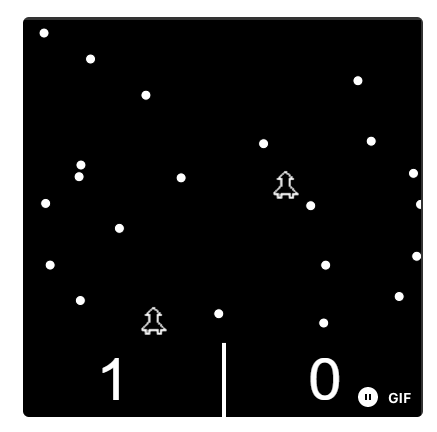

# Space Force (Using Brick)

## Proposal

For the project, we will be trying to replicate a basic version of the game Space Force using the brick library in haskell. Details of the game:
- The objective is to maximize the score before the timer runs out. 
- The player with the highest number of points before the timer runs out wins the game. 
- A player wins a point when the space-craft travels from the bottom of the screen to the top without hitting any of the obstacles. 
- If the spacecraft hits any of the obstacles during the course of the journey from the top to bottom, the spacecraft resets to the bottom of the screen.
- The spacecraft will have 3 degrees of freedom (Up, Left and Right) within the 2D space.
- Game screen will be horizontally divided into 2 halves with each half allotted to a single player.  

### Timer 
- There will exist an in-game timer at the end of which the player with maximum number of points wins.

### Score Update
- A player's score increments by 1 point when the space craft hits a pre-designated co-ordinate on the Y-Axis

### Spacecraft movement
- Has a default position on the X-Axis to start with (center on the X-Axis of the player's half of the screen). On the Y-Axis, space craft starts at the bottom of the screen.
- On every input (up, left or right), the space craft moves in the specified direction by a given number of points.
- On hitting an obstacle / reaching the top of the screen (a specific co-ordinate on the Y-Axis), the space craft returns to it's default position

### Obstacles
- Obstacles are spawned at random from the left and right of the screen
- Every obstacle moves either to the left or to the right.
- Speed of each obstacle is determined at random.
- An obstacle can travel across the player's screen halves.  

### Game Ending Conditions
- When the timer ends, the player with the higher score is declared the winner
- If the position of the pipe on the X-Axis is the same as that of the bird and the bird's position on the Y-Axis is not part of the pipe's gap, then a collision is determined and the game ends

### Wishlist of features
- Presently, the game expects both the players to play on the same keyboard (with one player using "arrow" keys and the other player using "W-A-S-D" keys for movement). But if time permits, we will implement support for online multiplayer

### Reference
[Game List Reference](https://dev.to/lukegarrigan/top-5-best-games-to-code-as-a-beginner-9n)