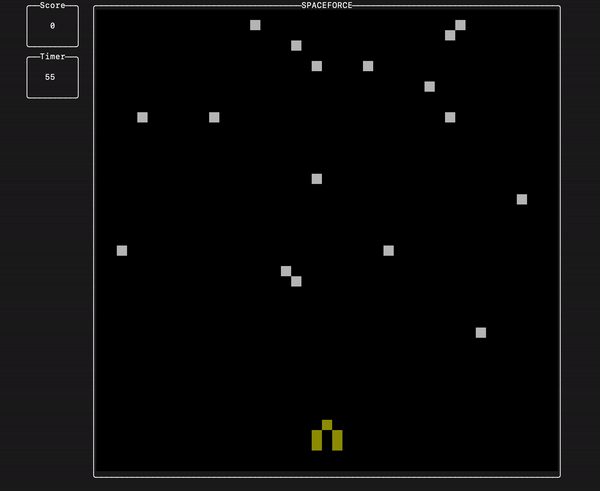
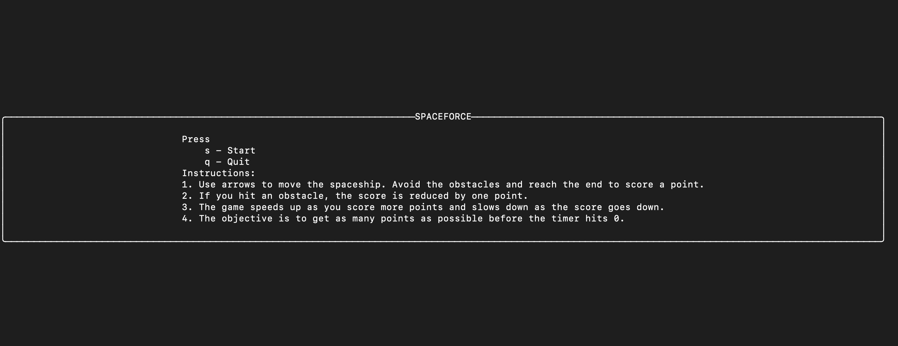

# Spaceforce

## Overview

### Terminal interface for the Spaceforce game. Built using the haskell [brick](https://hackage.haskell.org/package/brick-0.18) library.

Spaceforce is a game which involves navigating a space ship through a series of random obstacles on the screen. The objective of the game is to maximize the score within a time frame of 90 seconds. Some of the features of the game involves:
- The space ship starts at the bottom of the screen at a predefined location. 
- Use the arrow keys to navigate the ship in the 4 directions (up, down, left and right).
- Every time the space ship hits the top of the screen:
    - The score increases by a point and the space ship is reset to the predefined location at the bottom of the screen.
    - The speed of the obstacles increases.
- Obstacles are generated randomly on the screen from both the left end and the right end of the screen and move horizontally (depending on where the obstacle started off).
- Every time the space ship hits an obstacle, the space ship is reset to the bottom of the screen to the predefined locatioN and the score of the user decreases by 1.

Future features planned for the game:
- Option to pause the game.
- Multiple game modes.
- Leaderboard statistics.

<p align="center">
  
</p>

## Project Architecture
The main components of the projects are
### 1. Ship module
  This module has the major function related to the functioning to the game. It implements the functionalities listed below and more.
  * Initialization of the game object
  * Random generation of the rocks including direction of the rock generated and the position of the rock on the Y-Axis.
  * Movement of Ship based on keyboard events.
  * Movement of the rocks in the desired direction every tick event.
  * Detecting collision of Ship with rocks and taking the desired action.
  * Updation of the Score.
  * Controlling the speed of the game (pace at which the rocks travel on the screen).
  * Detecting the end of the game as the timer runs out.

### 2. UI module
  - This module takes care of the game display on the terminal. 
  - The Ship module is imported into the UI module and used display the states on the UI. It also implements the function to bind keyboard inputs to the game functions.
  - The UI module also displays an interactive menu prior to the start of the game.

## Installation
For installation from source follow these steps
1. Clone the repository using git clone.
```shell
git clone url
```
2. Install the required dependencies by running stack install
```shell
stack install
```

## Testing
The unit testing for game are in the test directory. They can run using
```shell
stack test
```
The result should show all tests passed.

## Playing the game

Launch the game using
```shell
stack run
```

After launching the game, follow the instructions on the menu. It should something like below.

<p align="center">
  
</p>

Press 'q' to quit at anytime, 'r' to restart the game.
